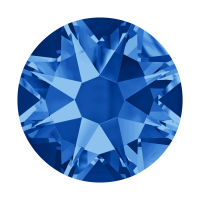

- [General Information](#general-information)
  - [About](#about)
  - [Former Contributors](#former-contributors)
- [Compilation & Execution](#compilation--execution)
  - [Requirements](#requirements)
  - [Build](#build)
  - [Run](#run)
- [Features](#features)
- [References](#references)
  - [About Sapphire](#about-sapphire)
  - [Using Sapphire](#using-sapphire)

--- 
# General Information

## About
***Sapphire*** 

* is an independent code which can calculate both radiative capture and inverse cross sections.

* is a new code, written in C++, designed primarily to simulate the decay of excited nuclei via the Monte Carlo technique. 

* generates realistic particle and γ-ray distributions resulting from the statistical decay of a compound nucleus having a predefined excitation energy,with decay probabilities based on the most recent experimental data compilations and state-ofthe-art theoretical models. The code is designed for large-scale multiprocessing and therefore is ideal for the generation of the large theoretical data sets often needed to determine experimental response functions without the need of excessive approximations. The transmission functions needed to form the probability distribution functions forMonte Carlo are identical to those required to calculate HF cross sections; therefore, the code can be used to calculate astrophysical reaction rates. 

* considers a range of projectile nuclei, and include four exit channels, namely: (particle,n), (particle,p), (particle,α), and (particle,γ ). 

* has the additional ability to calculate cross sections for photon induced reactions. 

* when used for cross-section calculations, does not include preequilibrium reactions, which makes them well suited to astrophysical studies because in these environments incident particles have energies that are typically less than approximately 10 MeV.

## Former Contributors
* original version of Sapphire by [Mary Beard](https://isnap.nd.edu/people/group-pages/mary-beard/). 
* Ethan Uberseder

# Compilation & Execution
## Requirements
Compiling Sapphire requires [CMake](https://cmake.org/), [ROOT](https://root.cern.ch/), and [GNU Scientific Library (GSL)](https://www.gnu.org/software/gsl/). Check the files in `cmake/Modules` whether cmake is looking for these packages in the right place. 

For an `automized generation of documentation files`, one needs [doxygen](http://doxygen.nl/) installed on the system.

For the `Message Passing Interface (MPI)` build, `boost 1.4` libraries are required. The MPI build is optional and can be enabled in the `CMakeLists.txt`.

## Build

1. Create a build directory under the main Sapphire directory and change to that directory. 
   ```bash
   mkdir build
   cd build
   ```
2. Run CMake against the main directory, optionally specifying the desired C++ compiler.
    ```bash
    cmake -DCMAKE_CXX_COMPILER=icpc  -DCMAKE_C_COMPILER=icc 
    ```
3. Type make install to build Sapphire.  The executable is put in
  the build directory.
    ```bash
    make install
    ```

Be aware that Sapphire links the paths to the needed tables at compile time.
While the executable can be moved, the main Sapphire directory should stay in
place.  If moved, the build process should be repeated.

## Run

To execute the code just enter

```
./sapphire X+a
```

where X is the heavy nucleus and a is the projectile. Examples are 25Mg+a or 60Fe+n.  

# Features

## Calculate Cross Sections


# References
## About Sapphire
If you are using *Sapphire* you should cite one or more of the references below.

* M. Beard, E. Uberseder, R. Crowter, and M. Wiescher, *Comparison of statistical model calculations for stable isotope neutron capture*, Physical Review C **90**, 034619 (2014), DOI: [10.1103/PhysRevC.90.034619](https://dx.doi.org/10.1103/PhysRevC.90.034619)
* Mary Beard, Ethan Uberseder, and M. Wiescher, *Statistical Model Calculations for (n,g) Reactions*, EPJ Web of Conferences **93**, 04001 (2015), DOI: [10.1103/PhysRevC.90.034619](https://dx.doi.org/10.1103/PhysRevC.90.034619)
  
## Using Sapphire
If you are using *Sapphire* for your research, please send us a reference of your work and we will list it here.
* X. Fang, W. P. Tan, M. Beard, R. J. deBoer, G. Gilardy, H. Jung, Q. Liu, S. Lyons, D. Robertson, K. Setoodehnia, C. Seymour, E. Stech, B. Vande Kolk, M. Wiescher, R. T. deSouza, S. Hudan, V. Singh, X. D. Tang, and E. Uberseder, *Experimental measurement of 12C+16O fusion at stellar energies*, Physical Review C **96**, 045804 (2017), DOI: [10.1103/PhysRevC.96.045804](https://dx.doi.org/10.1103/PhysRevC.96.045804)
* M. Beard, E. Uberseder, R. Crowter, and M. Wiescher, *Comparison of statistical model calculations for stable isotope neutron capture*, Physical Review C **90**, 034619 (2014), DOI: [10.1103/PhysRevC.90.034619](https://dx.doi.org/10.1103/PhysRevC.90.034619)
* Mary Beard, Ethan Uberseder, and M. Wiescher, *Statistical Model Calculations for (n,g) Reactions*, EPJ Web of Conferences **93**, 04001 (2015), DOI: [10.1103/PhysRevC.90.034619](https://dx.doi.org/10.1103/PhysRevC.90.034619)
